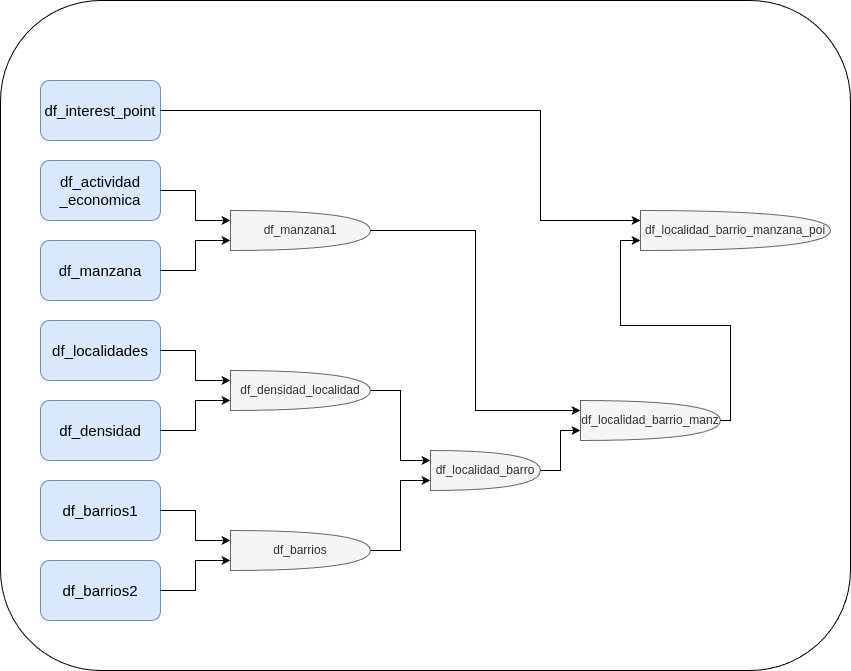

## Modelo de predicion del valor de m2 en Bogotá

- Este es un proyecto independiente cuyo ubjetivo es predicir el valor del m2 de inmuebles en la ciudad de Bogotá, para ello se utilizaron datos tomados de datos abiertos Bogotá 

En el siguente diagrama se muestra la estructura de los joins de las tablas

